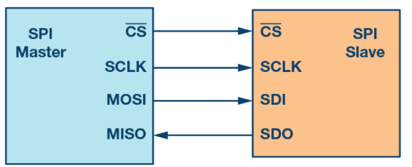

.. _SPI:

Introduction to SPI interface 
=============================

Serial peripheral interface (SPI) is one of the most widely used interfaces
between microcontroller and peripheral integraded circuits (ICs) such as:

* Sensors
* ADCs 
* DACs 
* Shift registers 
* SRAM 

SPI is a synchronous, full duplex master slave based interface.
The data from the master or the salve is syncrhonized on the rising of falling clack edge. 
Both master and slave can transmit data at the same time. The SPI interface can be in two forms: 

* 3-wire 
* 4-wire 

Tis documentation focuses on the popular 4-wire SPI interface, as shown in the Figure 1. 

Figure 1. SPI interface.

4-wire SPI devices have four signals: 

* clock (SPI CLKC, SCLK)
* Chip select (~CS)
* Master out, slave in (MOSI)
* Master int, salve out (MISO)

The device that generates the clock signal is called the mater. Data transmitted between the master
and the sale is syncrhonized to the clock generated by the master. SPI devices support much
higher clock frequencies compared to I2C inerfaces. Users should consult the product data sheet 
for the clock frequency specification of the SPI interface. 

SPI interaces can have only one master and can hace one or multiple salves. Figure 1 shows the SPI conenction between
the master and the slave. 

The chip select signal from the master is used to select the slave. This is normally an active low signal and is
pulled high to disconnect the slave from the SPI bus. When multiple slaves are used, an individual chip select the signal
for each slave is requiered from the master.

MOSI and MISO are data lines. MOSI transmits data from the master to the slave and MISO transmits data from the slave
to the master. 

